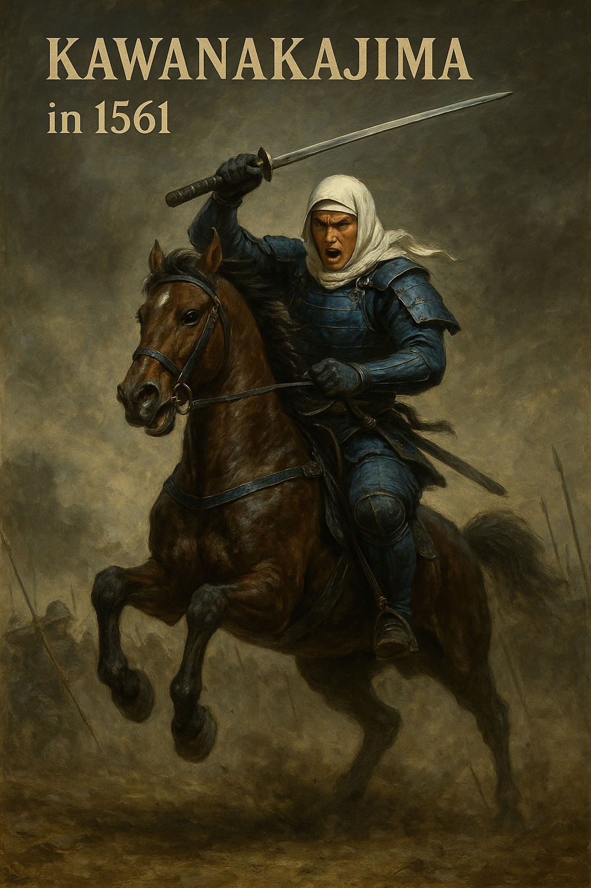

# 🏯🌍 Rekiden – A ChatGPT-Powered Historical Simulation Framework

**Rekiden** is a text-based, open-source simulation game that lets you relive—and reshape—turning points in history.  
Interact with ChatGPT to take on the role of historical figures and make critical decisions that could change the fate of a nation.

This is more than a game. Rekiden is an educational and interactive framework for exploring historical “what-ifs.”

---

🏠 [日本語版はこちら](./README.md)  
→ 日本語でRekidenを体験する

---

## 🎯 Project Overview

- **Genre**: Historical Simulation / Strategy (Text-based)
- **Format**: Markdown-based scenarios with decision branches
- **Supported Eras**:
  - 🏯 Sengoku Period (1555–1615) → Fully implemented
  - 🌍 World War II (1930–1945) → 5 routes completed (Ver. 1.0)
- **Goal**:
  - Learn and explore alternative historical paths through interactive simulation with AI
  - Combine strategic thinking, ethical dilemmas, and narrative generation into a single learning tool

---

## 📂 Directory Structure (EN)

```
Rekiden/
├─ README_en.md
├─ sengoku/
│  └─ periods/
│     ├─ 1555_sangoku_alliance_en.md
│     ├─ 1561_kawanakajima_en.md
│     ├─ 1575_nagashino_en.md
│     ├─ 1582-2_chugoku_ogaeshi_en.md
│     ├─ 1600_sekigahara_en.md
│     ├─ 1600_uesugi_if_en.md
│     └─ 1614_osaka_campaign_en.md
├─ ww2/
│  ├─ index_en.md
│  ├─ japan/
│  │  └─ yamamoto_navy_en.md
│  ├─ usa/
│  │  ├─ roosevelt_strategy_en.md
│  │  ├─ oppenheimer_ethics_en.md
│  │  └─ macarthur_pacific_en.md
│  └─ germany/
│     └─ hitler_politics_en.md
├─ templates/
│  └─ scenario_template_en.md
├─ docs/
│  └─ how_to_play_en.md
```

---

## 🎮 Gameplay with ChatGPT

Rekiden is designed to be played with ChatGPT (GPT-4 or later):

1. Paste any `.md` scenario into ChatGPT
2. Choose a playable character (e.g., "Uesugi Kenshin," "Roosevelt," "Oppenheimer")
3. Enter choices each turn (“Negotiate,” “Attack,” “Develop Technology,” etc.)
4. ChatGPT continues the story, generating outcomes dynamically

> 🧠 ChatGPT acts as Game Master, Narrator, and Simulation Engine.

---

## 📘 How to Play

▶︎ [Getting Started Guide](./docs/how_to_play_en.md)

---

## 🏯 Sengoku Period Scenarios

| Year | Title                            | File                                                                 |
|------|----------------------------------|----------------------------------------------------------------------|
| 1555 | The Tripartite Alliance          | [1555_sangoku_alliance_en.md](./sengoku/periods/1555_sangoku_alliance_en.md) |
| 1561 | Battle of Kawanakajima           | [1561_kawanakajima_en.md](./sengoku/periods/1561_kawanakajima_en.md) |
| 1575 | Battle of Nagashino              | [1575_nagashino_en.md](./sengoku/periods/1575_nagashino_en.md) |
| 1582 | The Great Return from Chūgoku    | [1582-2_chugoku_ogaeshi_en.md](./sengoku/periods/1582-2_chugoku_ogaeshi_en.md) |
| 1600 | Battle of Sekigahara             | [1600_sekigahara_en.md](./sengoku/periods/1600_sekigahara_en.md) |
| 1600 | Righteous Rule (Uesugi IF)       | [1600_uesugi_if_en.md](./sengoku/periods/1600_uesugi_if_en.md) |
| 1614 | Siege of Osaka                   | [1614_osaka_campaign_en.md](./sengoku/periods/1614_osaka_campaign_en.md) |

### 🏯 What is the Sengoku Period?

New to Japanese history?  
See our short introduction to understand the **chaotic and fascinating era** of warlords, alliances, betrayals, and ambition.

▶︎ [Intro to the Sengoku Period (sengoku_intro_en.md)](./docs/sengoku_intro_en.md)

---

## 🌍 World War II Scenarios

▶︎ [WW2 Scenario Menu (EN)](./ww2/index_en.md)

| Nation | Role           | Theme                                | File |
|--------|----------------|---------------------------------------|-------|
| 🇯🇵 Japan | Yamamoto       | Pearl Harbor & Midway strategy       | [yamamoto_navy_en.md](./ww2/japan/yamamoto_navy_en.md) |
| 🇺🇸 USA   | Roosevelt      | Total war & alliance building        | [roosevelt_strategy_en.md](./ww2/usa/roosevelt_strategy_en.md) |
| 🇺🇸 USA   | Oppenheimer    | Ethics of atomic bomb development    | [oppenheimer_ethics_en.md](./ww2/usa/oppenheimer_ethics_en.md) |
| 🇺🇸 USA   | MacArthur      | Pacific War and island campaign      | [macarthur_pacific_en.md](./ww2/usa/macarthur_pacific_en.md) |
| 🇩🇪 Germany | Hitler       | Invasion of Poland & diplomacy       | [hitler_politics_en.md](./ww2/germany/hitler_politics_en.md) |

---

## 🧪 Sample Play Logs

- [Kawanakajima – Uesugi Kenshin (ENG)](templates/1561_kawanakajima_kenshin_user001.md)  
- [Kawanakajima – Fūrin Kazan Mode (ENG)](templates/1561_kawanakajima_furinkazan_en.md)

---

## ✅ Project Status

| Feature                         | Status |
|----------------------------------|--------|
| All Sengoku scenarios (JP)       | ✅ Done |
| 5 WW2 scenarios (JP/EN)          | ✅ Done |
| English scenario support         | ✅ Ongoing |
| Future simulations               | ❌ Removed |
| Streamlit GUI                    | 🔜 Planned |
| Save/Resume (Markdown+JSON)     | 🔜 Planned |

---

## 📜 License

MIT License © 2025 Shinichi Samizo  
See [LICENSE](./LICENSE) for details.

---

## 👤 Author Profile

**Shinichi Samizo**  
- M.S. in Electrical and Electronic Engineering, Shinshu University  
- Former R&D Engineer at Seiko Epson Corporation (1997–)

📌 **Expertise**:  
- Semiconductor devices (logic, memory, high-voltage mixed process)  
- Thin-film piezoelectric actuators  
- PrecisionCore printhead commercialization, configuration management, and technical education

📬 **Contact**  
- ✉️ Email: [shin3t72@gmail.com](mailto:shin3t72@gmail.com)  
- 🐦 X (Twitter): [https://x.com/shin3t72](https://x.com/shin3t72)  
- 💻 GitHub: [https://samizo-aitl.github.io/](https://samizo-aitl.github.io/)

---

**Rekiden** is where strategy meets storytelling.  
History is not fixed—rewrite it.

---

## 💬 Feedback and Discussion

We welcome your feedback, ideas, and suggestions for the **Rekiden** project.  
Whether you're interested in educational use, historical storytelling, or alternative battle strategies — your input helps shape the future of this simulation.

👉 [Join the discussion on GitHub Discussions](https://github.com/Samizo-AITL/Rekiden/discussions)

Examples:
- Requests for other battles 
- Comparative views with other countries' history
- Interest in AI-assisted historical simulations

Your insights can elevate Rekiden to a global, collaborative knowledge platform.

---

## Uesugi Kenshin - Battle of Kawanakajima (1561)



A dynamic depiction of young Uesugi Kenshin charging into battle on horseback, captured in a realistic oil painting style.  
Ideal as a key visual for Rekiden historical education materials.

---
