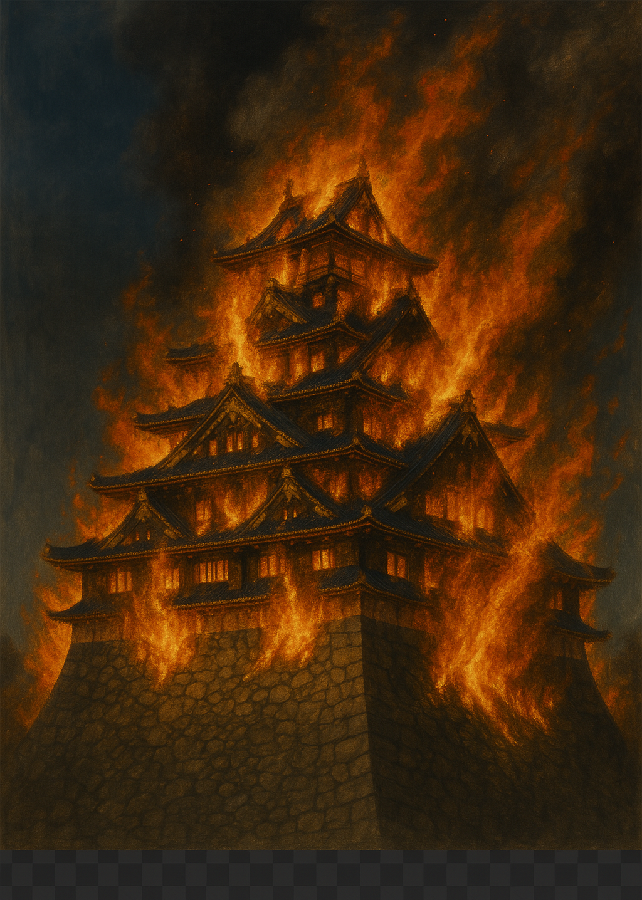

# 🏯 Intro to the Sengoku Period – Japan’s Age of Warring States

Welcome to the Sengoku Period (戦国時代) – Japan’s “Age of Warring States.”  
If you’re new to Japanese history, this guide will help you understand the people, conflicts, and shifting powers behind **Rekiden**.

---

## ⏳ What Was the Sengoku Period?

- **Timeframe**: 1467 – 1615 (about 150 years)
- **Meaning**: "Sengoku" = Warring States — Japan fell into civil war
- **Background**:
  - Central authority collapsed (Ashikaga shogunate weakened)
  - Regional lords (*daimyo*) rose to power and fought for dominance
  - Frequent betrayals, shifting alliances, and deadly battles
  - Ultimately unified by the Three Great Unifiers

---

## 👑 The Three Great Unifiers

| Name | Role | Known For |
|------|------|-----------|
| **Oda Nobunaga** | Ruthless revolutionary | Crushed Buddhist armies, used firearms, defeated Imagawa |
| **Toyotomi Hideyoshi** | Strategic genius | Rose from peasant to ruler, carried out unification |
| **Tokugawa Ieyasu** | Patient tactician | Won the Battle of Sekigahara and established the shogunate |

These figures play major roles in many Rekiden scenarios — as leaders, allies, or enemies.

---

## ⚔️ Core Themes in Sengoku Strategy

| Theme | Description |
|-------|-------------|
| **Betrayal** | Alliances were fragile; trust was rare |
| **Military Innovation** | Guns (tanegashima), pike formations, siege tactics |
| **Clans and Castles** | Power came from territory, rice production, and strongholds |
| **Upstarts vs Elites** | Low-born men like Hideyoshi rose to rule through cunning |

---

## 📅 Power Shifts Across Time and Region

The following table summarizes the major daimyo and powers **by region and by year**, including **key historical events** that define each era.

### 🗺️ Sengoku Power Map (Region × Year × Key Events)

| Region       | **1560** ⚔️ *Battle of Okehazama* Oda defeats Imagawa | **1582** 🔥 *Honnoji Incident* Nobunaga assassinated | **1600** ⚔️ *Battle of Sekigahara* Tokugawa rises | **1614** 🏯 *Siege of Osaka begins* Final clash: Tokugawa vs Toyotomi |
|--------------|-------------------------------------------------------------|------------------------------------------------------------|-----------------------------------------------|------------------------------------------------------------|
| **Tohoku**   | Date Harumune (minor)                                       | Date Masamune (rising)                                      | Date Masamune (East Army)                    | Date Masamune (loyal Tokugawa vassal)                       |
| **Hokuriku** | Uesugi Kenshin                                              | Uesugi Kagekatsu                                            | Uesugi Kagekatsu (West Army)                 | Uesugi under Tokugawa control                              |
| **Kanto**    | Hojo Ujiyasu (dominant)                                     | Hojo Ujimasa                                                | Tokugawa Ieyasu (Kanto ruler)                | Tokugawa Hidetada (shogun in Edo)                           |
| **Shin'etsu**| Takeda Shingen                                              | Takeda clan destroyed → Oda territory                       | Tokugawa or Uesugi controlled                | Direct Tokugawa control                                    |
| **Tokai**    | Imagawa vs Oda                                              | Oda Nobunaga dominates                                      | Tokugawa Ieyasu (power base)                 | Tokugawa + hereditary vassals                              |
| **Kinki**    | Miyoshi clan / Ashikaga shogunate (declining)              | Akechi → Toyotomi (after Honnoji & Yamazaki battle)         | Ishida Mitsunari (West) / Toyotomi Hideyori  | Toyotomi Hideyori (Osaka Castle) vs Tokugawa               |
| **Chugoku**  | Mori Motonari                                               | Mori Terumoto                                               | Mori Terumoto (West Army commander)          | Mori (reduced power, under Tokugawa watch)                 |
| **Shikoku**  | Chosokabe Motochika (rising)                                | Chosokabe unifies Shikoku                                   | Chosokabe Morichika (West Army)              | Chosokabe (joins Osaka side → executed)                    |
| **Kyushu**   | Fragmented: Otomo / Shimazu / Ryuzoji                        | Shimazu conquers most of Kyushu                             | Shimazu Yoshihiro (West Army)                | Shimazu Tadatsune (submits to Tokugawa)                    |

---

## 🧭 How Does Rekiden Use This?

Rekiden lets you:

- **Choose an era** (e.g., 1582) and a region (e.g., Chugoku)
- **Play as a historical daimyo**, facing real conditions and rival factions
- **Rewrite history** through your decisions, with ChatGPT dynamically narrating outcomes

Each scenario in Rekiden is rooted in this shifting political landscape — and your choices may change the future.

---

## 🗂️ Recommended Scenarios by Year

| Year | Scenario | File |
|------|----------|------|
| 1560 | Battle of Okehazama (Oda vs Imagawa) | *(Coming soon)* |
| 1582 | The Great Return from Chūgoku (Hideyoshi vs Akechi) | [1582-2_chugoku_ogaeshi_en.md](../sengoku/periods/1582-2_chugoku_ogaeshi_en.md) |
| 1600 | Rise of Tenchijin – Uesugi IF | [1600_uesugi_if_en.md](../sengoku/periods/1600_uesugi_if_en.md) |
| 1614 | Siege of Osaka | [1614_osaka_campaign_en.md](../sengoku/periods/1614_osaka_campaign_en.md) |

---

## 👋 Final Note

You don't need to be a history expert to enjoy **Rekiden**.  
Just choose a time and place — and let AI guide you through Japan's most turbulent age.

Will you restore peace? Seize power? Or fall in the chaos?

> **History is written by your choices.**

---

### 🔥 Osaka Castle in Flames

The image below is a conceptual depiction of Osaka Castle engulfed in flames, symbolizing the final chapter of the Sengoku period.

---
