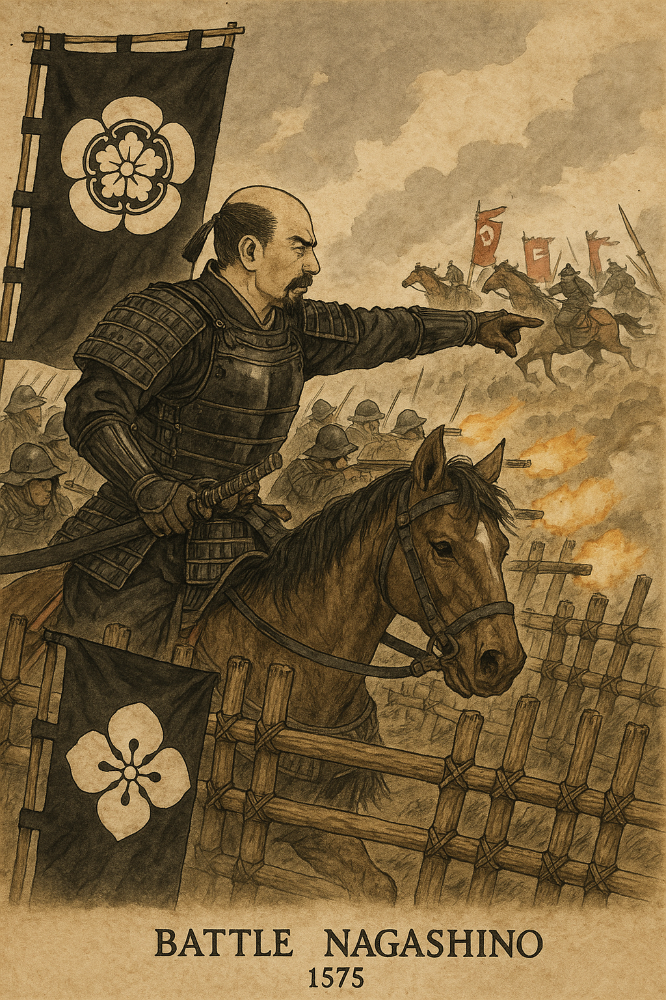

    
---

# 🏯 戦国時代とは？– 日本の「下剋上」と群雄割拠の時代を知る　

ようこそ、戦国時代（せんごくじだい）へ。  
このページでは、ChatGPTと連携する歴史シミュレーション「**Rekiden**」をより深く楽しむために、  
戦国時代の背景・武将・勢力図をわかりやすく紹介します。

---

## ⏳ 戦国時代とは？

- **時代**：1467年（応仁の乱）〜1615年（大坂の陣）  
- **意味**：「戦国」は“戦う国々”の意。日本全体が内乱状態に  
- **背景**：
  - 中央の将軍権力が衰退（足利将軍の影響力低下）
  - 各地の大名が力を持ち、独立して戦い始める
  - 同盟・裏切り・暗殺が繰り返され、実力がすべての時代へ
  - 最終的には「三英傑」により統一される

---

## 👑 三英傑とは？

| 名前 | 立場 | 特徴 |
|------|------|------|
| **織田信長** | 革新派の革命児 | 鉄砲導入・仏教勢力排除・中央集権を目指す |
| **豊臣秀吉** | 農民出身の天下人 | 検地・刀狩で支配強化、朝鮮出兵も実施 |
| **徳川家康** | 忍耐の戦略家 | 関ヶ原で勝利し、260年続く江戸幕府を開く |

Rekidenでは、彼らを主人公・敵・中立勢力として操作可能です。

---

## ⚔️ 戦国の戦略テーマ

| キーワード | 内容 |
|------------|------|
| **下剋上** | 身分を問わず、力のある者が上に立つ（例：秀吉） |
| **裏切りと謀略** | 同盟は簡単に破られ、油断禁物 |
| **軍事革新** | 鉄砲・集団戦法・城攻めが急速に進化 |
| **城と国力** | 石高・人口・米による国力差が明確に |

これらはRekiden内の選択肢やイベント分岐に反映されています。

---

## 📅 年代と地域で見る勢力図

以下の表は、戦国時代における**地域ごとの主要勢力**を、  
**1560 / 1582 / 1600 / 1614年**の4つの重要な年と共に整理したものです。  
さらに、その年を代表する**主要イベント**も記載しています。

### 🗺️ 戦国勢力早見表（地域 × 年 + イベント）

| 地域       | **1560年** ⚔️ 桶狭間の戦い（信長が今川義元を討つ） | **1582年** 🔥 本能寺の変（信長死す）／中国大返し | **1600年** ⚔️ 関ヶ原の戦い（徳川 vs 西軍） | **1614年** 🏯 大坂の陣・冬（徳川 vs 豊臣） |
|------------|---------------------------------------------------|------------------------------------------------------|------------------------------------------------|------------------------------------------------------|
| **東北**   | 伊達晴宗（弱小）                                | 伊達政宗（台頭中）                                   | 伊達政宗（東軍）                               | 伊達政宗（徳川方・外様大名）                         |
| **北陸**   | 上杉謙信                                          | 上杉景勝                                            | 上杉景勝（西軍）                               | 上杉景勝（徳川の下で存続）                          |
| **関東**   | 北条氏康（支配拡大）                              | 北条氏政                                            | 徳川家康（関東制圧）                           | 徳川秀忠（江戸幕府将軍）                            |
| **甲信越** | 武田信玄                                          | 武田氏滅亡 → 織田支配                              | 徳川または上杉支配                            | 徳川直轄地（甲府など）                              |
| **東海**   | 今川義元 vs 織田信長（尾張）                     | 織田信長（最大勢力）                                | 徳川家康（三河出身）                            | 徳川＋譜代大名が支配                                 |
| **近畿**   | 三好長慶／足利将軍（弱体）                        | 明智光秀 → 秀吉（山崎合戦）                          | 石田三成（西軍）／豊臣秀頼（象徴）             | 豊臣秀頼（大坂城） vs 徳川                         |
| **中国**   | 毛利元就（拡大期）                                | 毛利輝元                                            | 毛利輝元（西軍・総大将）                       | 毛利輝元（減封されたが存続）                        |
| **四国**   | 長宗我部元親（拡大中）                            | 長宗我部（四国統一）                                | 長宗我部盛親（西軍）                           | 長宗我部盛親（大坂方→敗死）                         |
| **九州**   | 大友・島津・竜造寺（三つ巴）                     | 島津義久（制圧目前）                                | 島津義弘（西軍）                                | 島津忠恒（徳川へ形式服従）                          |

---

## 🎮 Rekidenと連動するには？

この勢力表を使って：

- **自分が活躍したい時代・地域**を選べます
- 例：1582年の中国地方 → 秀吉の「中国大返し」  
- 例：1600年の東北 → 上杉景勝で「義の戦い」  

ChatGPTが**軍師・語り部・戦況シミュレータ**としてプレイを進行します。

---

## 📘 年別おすすめシナリオ（Rekiden）

| 年代 | タイトル                     | ファイル |
|------|------------------------------|----------|
| 1560 | 桶狭間の戦い（織田 vs 今川） | ※準備中 |
| 1582 | 中国大返し（豊臣 vs 明智）   | `1582-2_chugoku_ogaeshi_en.md` |
| 1600 | 義の天下（上杉IFルート）     | `1600_uesugi_if_en.md` |
| 1614 | 大坂の陣（豊臣家最期）       | `1614_osaka_campaign_en.md` |

---

## 👋 最後に

Rekidenは、歴史の知識がなくても楽しめる**体験型シミュレーション**です。  
時代と武将を選んで、AIと共に「もう一つの戦国時代」を創りましょう。

> **歴史は、あなたの決断で変わる。**

---

  

> **🔥 Battle of Nagashino (1575) – The Turning Point in Sengoku Warfare**  
This historical artwork illustrates the pivotal Battle of Nagashino, where Oda Nobunaga deployed organized arquebus (matchlock) volleys behind wooden barricades to repel the feared cavalry of the Takeda clan. It marks a revolutionary moment in Japanese military tactics: the triumph of firearms and defensive strategy over traditional cavalry assaults. The depicted mokko-crested banner represents Nobunaga's authority, while the Takeda cavalry charge into coordinated gunfire. The battle not only solidified Nobunaga’s military dominance but also signaled a shift toward modern warfare in the Sengoku era.

---

  

> **🔥 Osaka Castle in Flames – The Fall of the Toyotomi Clan (1615)**  
This dramatic depiction symbolizes the final siege of Osaka Castle in 1615, marking the end of the Toyotomi clan and the conclusion of Japan’s Sengoku Period. Set ablaze during the Summer Campaign of the Siege of Osaka, the castle’s destruction represented the final victory of Tokugawa Ieyasu and the unification of Japan under the Tokugawa Shogunate. The image captures both the physical destruction and the symbolic collapse of the last resistance to Tokugawa rule. Smoke, flames, and the silhouette of the castle evoke the end of an era of warlords and the dawn of a new political order.

---
