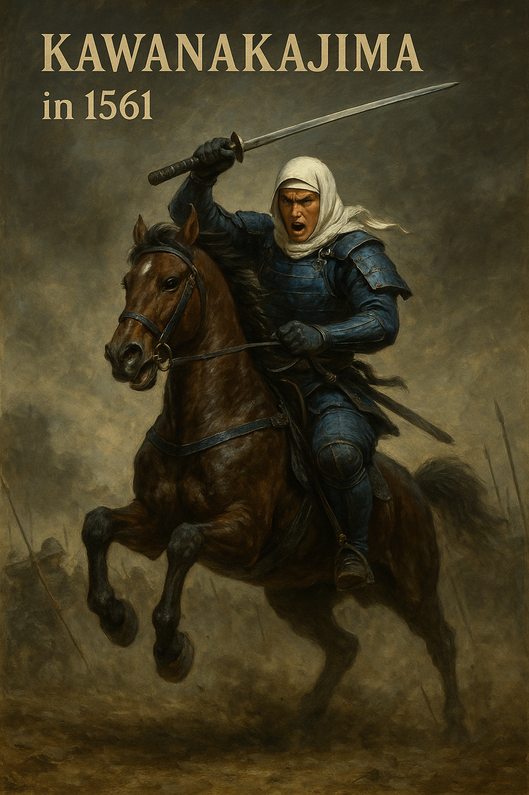

---

# 🏯🌍 **Rekiden – A ChatGPT-Powered Historical Simulation Framework**

**Rekiden** is a **text-based, open-source simulation framework** that lets you  
**relive — and reshape — turning points in history**.  
You take the role of **a warlord, a national leader, or a scientist**, making *critical decisions* at key historical crossroads.  
The outcomes depend on your strategy and choices.

🏠 [**日本語版はこちら / Japanese Version**](../index.md)

---

## 🎯 **Project Overview**

| **Item** | **Details** |
|---|---|
| **Genre** | Historical Simulation / Strategy (Text-based) |
| **Format** | Markdown-based branching scenarios |
| **Eras Covered** | 🏯 Sengoku Period (1555–1615) – *Fully implemented* 🌍 WWII (1939–1945) – *5 routes completed (Ver. 1.0)* |
| **Goals** | Learn and explore **alternative history** through interactive simulation with AI. Combine **strategic thinking**, **ethical dilemmas**, and **narrative generation** into a single educational tool. |

---

## 🎮 **How to Play with ChatGPT**

1. **Paste** any `.md` scenario into ChatGPT  
2. **Choose** a playable character (e.g., *Uesugi Kenshin*, *Roosevelt*, *Oppenheimer*)  
3. **Enter choices** each turn (“Negotiate,” “Attack,” “Develop Technology,” etc.)  
4. ChatGPT acts as **Game Master**, **Narrator**, and **Simulation Engine**

▶︎ [**Getting Started Guide**](../docs/how_to_play_en.md)

---

## 🏯 **Sengoku Period Scenarios (1555–1614)**

| **Year** | **Factions / Key Figures** | **Title** | **File** |
|---|---|---|---|
| 1555 | Imagawa Yoshimoto, Takeda Shingen, Hōjō Ujiyasu | *The Tripartite Alliance* | [1555_sangoku_alliance_en.md](../sengoku/periods/1555_sangoku_alliance_en.md) |
| 1561 | Takeda Shingen vs Uesugi Kenshin | *Battle of Kawanakajima* | [1561_kawanakajima_en.md](../sengoku/periods/1561_kawanakajima_en.md) |
| 1575 | Oda Nobunaga & Tokugawa Ieyasu vs Takeda Katsuyori | *Battle of Nagashino* | [1575_nagashino_en.md](../sengoku/periods/1575_nagashino_en.md) |
| 1582 | Akechi Mitsuhide vs Hashiba Hideyoshi | *The Great Return from Chūgoku* | [1582-2_chugoku_ogaeshi_en.md](../sengoku/periods/1582-2_chugoku_ogaeshi_en.md) |
| 1600 | Uesugi Kagekatsu (IF) vs Tokugawa Ieyasu | *Righteous Rule (Uesugi IF)* | [1600_uesugi_if_en.md](../sengoku/periods/1600_uesugi_if_en.md) |
| 1614 | Sanada Yukimura vs Tokugawa Hidetada | *Siege of Osaka* | [1614_osaka_campaign_en.md](../sengoku/periods/1614_osaka_campaign_en.md) |

▶︎ [**Intro to the Sengoku Period**](../docs/sengoku_intro_en.md)

---

## 🌍 **World War II Scenarios (1939–1945)**

**Allies** 🇬🇧 🇺🇸 🇫🇷 vs. **Axis** 🇩🇪 🇮🇹 🇯🇵

| **Year** | **Nation** | **Player** | **Title** | **File** |
|---|---|---|---|---|
| 1941 | 🇯🇵 Japan | Yamamoto | *Pearl Harbor & Midway Strategy* | [yamamoto_navy_en.md](../ww2/japan/yamamoto_navy_en.md) |
| 1941 | 🇺🇸 USA | Roosevelt | *Total War & Alliance Building* | [roosevelt_strategy_en.md](../ww2/usa/roosevelt_strategy_en.md) |
| 1945 | 🇺🇸 USA | Oppenheimer | *Ethics of Atomic Bomb Development* | [oppenheimer_ethics_en.md](../ww2/usa/oppenheimer_ethics_en.md) |
| 1942 | 🇺🇸 USA | MacArthur | *Pacific Front & Philippine Campaign* | [macarthur_pacific_en.md](../ww2/usa/macarthur_pacific_en.md) |
| 1939 | 🇩🇪 Germany | Hitler | *Invasion of Poland & Diplomatic Crisis* | [hitler_politics_en.md](../ww2/germany/hitler_politics_en.md) |

▶︎ [**Intro to World War II**](../ww2/ww2_overview_en.md)

---

### 🐉 **Special Scenario – The Sleeping Dragon Awakens: Battle of Red Cliffs (AD 208)**

A non-interactive literary scenario featuring Zhuge Liang.  
Written in **English** with **Traditional Chinese** elements.  
▶︎ [**Read Scenario**](../three_kingdoms/red_cliffs_en.md)

---

## 🧪 **Sample Play Logs**

- [*Kawanakajima – Uesugi Kenshin (ENG)*](../templates/1561_kawanakajima_kenshin_user001.md)  
- [*Fūrin Kazan Mode (ENG)*](,./templates/1561_kawanakajima_furinkazan_en.md)

---

## ✅ **Project Status**

| **Feature** | **Status** |
|---|---|
| Sengoku scenarios (JP) | ✅ Done |
| WWII scenarios (JP/EN) | ✅ Done |
| English scenario support | ✅ Ongoing |
| Future simulations | ❌ Removed |
| Streamlit GUI | 🔜 Planned |
| Save/Resume (Markdown+JSON) | 🔜 Planned |

---

## 📜 **License**

MIT License © 2025 **Shinichi Samizo**  
See [**LICENSE**](../LICENSE) for details.

---

## 👤 **Author**

**Shinichi Samizo**  
**Semiconductors × Control × AI × History** — *Integrated Creator*

| **Expertise** | Semiconductor Device Technology (CMOS Logic / Memory / Integration) Control Theory (Robust) AI Applications & Educational Design Historical Scenario Creation (Sengoku, WWII, Three Kingdoms) |
|---|---|
| **Email** | [shin3t72@gmail.com](mailto:shin3t72@gmail.com) |
| **X (Twitter)** | [https://x.com/shin3t72](https://x.com/shin3t72) |
| **Web** | [https://samizo-aitl.github.io/](https://samizo-aitl.github.io/) |

💡 **Rekiden** bridges the "what-if" of history and technology,  
providing a stage to learn, strategize, and create — all at once.

---

**Rekiden** is where **strategy meets storytelling**.  
**History is not fixed — rewrite it.**

---

## 💬 **Feedback and Discussion**

We welcome your **feedback, ideas, and suggestions** for the **Rekiden** project.  
Whether you're interested in **educational use**, **historical storytelling**, or **alternative battle strategies** — your input helps shape the future of this simulation.

👉 [**Join the discussion on GitHub Discussions**](https://github.com/Samizo-AITL/Rekiden/discussions)

---

## 🖼 **Uesugi Kenshin – Battle of Kawanakajima (1561)**

  

*A dynamic depiction of young Uesugi Kenshin charging into battle on horseback,  
captured in a realistic oil painting style.*
