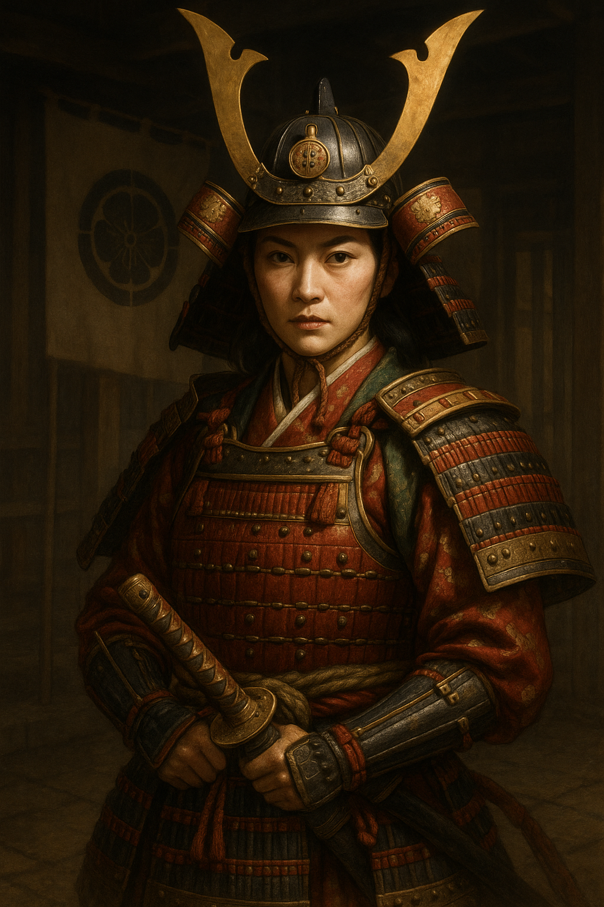

---

# ⚔️ 1582–1584 大決定版シナリオ — 本能寺からお市政権まで
（scenario_main.md）

本ファイルは「本能寺の変 → 中国大返し → 山崎の戦い → 清須会議 → 賤ヶ岳 →（IF）柴田政権 →（IF）お市政権 →（IF）明智政権 →（IF）徳川独立」を一望できる**物語本編＋歴史解説**です。

---

## 序章：本能寺の変（1582年6月）
天下人・織田信長が京都本能寺で家臣 **明智光秀** の急襲を受け自刃。  
日本全土は一夜にして**覇権の空白**へ。各勢力は迅速な意思決定を迫られる。

### 勢力状況
- **羽柴秀吉**：備中高松城を包囲中。毛利との講和 → 東帰の可否を判断。  
- **明智光秀**：畿内の掌握を急ぎ、情報封鎖・朝廷工作・動員に奔走。  
- **柴田勝家**：北陸（越前・加賀）で軍事行動。清須の主導権を狙う。  
- **徳川家康**：堺滞在。命がけの帰国（伊賀越え）を検討。  

📖 **解説｜本能寺の変とは**  
最強の統一候補・信長が家臣に討たれた事件。ローマ史の**「カエサル暗殺」**に喩えられ、**最有力者の突然の不在**が内戦の引き金となった。

---

## 第一章：中国大返し（1582年6月）
羽柴秀吉は**毛利と即時講和**し、備中から畿内へ**10日前後の強行軍**。これが「**中国大返し**」。  
光秀は**情報封鎖**と**諸勢力の抱き込み**で対抗する。

**イベント**  
- 「情報封鎖」（明智）／成功：羽柴の帰還遅延や同盟分断が起きる  
- 「中国大返し」（羽柴）／成功：史実通りの速度で山崎へ到着

📖 **解説｜大返しの凄み**  
1日30–40km級の連続行軍。雨天・補給・橋梁修理・士気維持など**近代的兵站運用**が必要だった。

---

## 第二章：山崎の戦い（1582年6月13日）
京都南・天王山を軸に**羽柴 vs 明智**が激突。結果はのちの天下を決める。

- **羽柴勝利** → 第三章「清須会議」へ  
- **明智勝利** → IF「明智政権」へ分岐

**イベント例**  
- 「細川藤孝の去就」／判定で兵力増減
- 「天王山先占」／羽柴が高地を確保できるか

📖 **解説｜なぜ天王山か**  
京都・大阪を結ぶ要衝。高地を押さえる側が**視界・通信・射撃**で有利。

---

## 第三章：清須会議（1582年7月）
織田後継（**三法師／信雄／信孝**）を巡って**羽柴・柴田・丹羽・池田**が角逐。

- **羽柴優勢**：三法師推戴 → 後見として実権を掌握  
- **柴田優勢**：信孝推戴 → 北陸ブロックの発言力増大

📖 **解説｜清須会議の意味**  
軍事力だけでなく**家中の承認**が不可欠。ここでの政治勝利が、のちの**賤ヶ岳**の兵力・同盟関係に直結する。

---

## 第四章：賤ヶ岳の戦い（1583年）
北近江で**羽柴 vs 柴田**が決戦。前田利家の動向が鍵を握る。

- **羽柴勝利**：豊臣政権へ進展  
- **柴田勝利**：IF「北国政権」ルートへ

📖 **解説｜前田利家の去就**  
織田家の旧臣で人気が高い。彼の選択は**士気・同盟・戦後秩序**に波及。

---

## IFルートA：柴田政権（1583年〜）
清須・賤ヶ岳を制した勝家が越前・加賀を基盤に**北国政権**を樹立。  
弱点は畿内掌握の遅さ。上杉・徳川・毛利・伊達との**外周外交**が生命線。

📖 **解説｜北国政権の現実性**  
北陸商圏と海路で**対明・対朝貢**も視野。東アジア交易を軸にした**別系統の近世化**があり得た。

---

## IFルートB：お市政権（1584年〜）
勝家失脚後、**お市の方**が未亡人ながら北国連合を継承。  
**女系の正統性＋縁組外交**で畿内の承認を獲得していく。

📖 **解説｜女傑政権というIF**  
戦国に女性当主の長期政権は存在しない。だからこそ**縁組・同盟・象徴性**を強調するプレイが核心。

### お市女将軍（兜姿）

#### 解説
お市の方（1547–1583）は、織田信長の妹として知られる戦国女性である。  
史実では浅井長政の妻となり、後に柴田勝家に再嫁したが、勝家の死とともにその生涯を閉じた。  

本シナリオでは **IFルートB「お市政権」** として、勝家亡き後に彼女が北国連合を継承し、女傑として政権を担う姿を描く。  
兜をまとった「女将軍」としてのイメージは、戦国時代に女性が実際に長期政権を築いた事例がない中で、あえて「女性による覇権」という歴史の可能性を象徴している。

- **文化的意義**：男性武将中心の歴史観に対し、女性の政治的可能性を提示する。  
- **ゲーム的役割**：外交・同盟・象徴性が強調され、戦闘だけでなく「婚姻外交」や「文化的影響力」が勝敗を左右する。  
- **海外向け補足**：Samurai helmet（兜）と甲冑姿は、戦国大名の権威を示す伝統的象徴であり、ここでは「女傑の覇権」を視覚的に強調している。
- 
---

## IFルートC：明智政権（1582年〜）
山崎で勝利した光秀は、朝廷・公家を背景に**官僚主義的な短期政権**を樹立。  
徳川・柴田・羽柴からの圧力にどう対処するかが課題。

📖 **解説｜明智のめざす国家像**  
軍事一辺倒ではなく**朝廷権威と行政**を重視。**近世的官僚政権**への萌芽とみられることも。

---

## IFルートD：徳川独立（1584年〜）
畿内が膠着した場合、徳川家康は東海を固め台頭。のちの**小牧・長久手**へ接続。

📖 **解説｜東国武家政権**  
東海道・中山道の**物流制覇**と城下整備で、のちの江戸政権の基盤が形成される。

---

## エンディング分岐（まとめ）
- 🌅 **太閤の道**：羽柴（豊臣）政権  
- ❄️ **北国の覇道**：柴田政権（IF）  
- 🔥 **短き治世**：明智政権（IF）  
- 🏯 **東国武家政権**：徳川独立（IF）  
- 👑 **女将軍の天下**：お市政権（IF）

---

# 📊 勢力別能力表（character_stats.md）

能力は【統率／武力／知力／政治／カリスマ】（最大100）。数値はゲームバランス優先の近似。

---

## 🟥 羽柴軍（羽柴秀吉）
- 拠点：播磨・摂津 → 大坂
- 特性：⚡機動／🧠調略／🏗築城／🔫鉄砲

| 武将名               | 統率 | 武力 | 知力 | 政治 | カリスマ | 備考 |
|----------------------|------|------|------|------|----------|------|
| 羽柴秀吉             | 88   | 80   | 88   | 82   | 90       | 総大将・大返し |
| 羽柴秀長（豊臣秀長） | 84   | 72   | 86   | 84   | 82       | 参謀総括 |
| 黒田官兵衛           | 85   | 72   | 92   | 80   | 78       | 軍師 |
| 竹中半兵衛*          | 70   | 60   | 96   | 70   | 75       | if客将 |
| 蜂須賀正勝           | 78   | 80   | 70   | 68   | 75       | 機動 |
| 加藤清正             | 80   | 85   | 68   | 60   | 72       | 槍働き |
| 福島正則             | 75   | 82   | 65   | 58   | 70       | 猛将 |
| 丹羽長秀             | 82   | 74   | 80   | 84   | 76       | 筆頭宿老 |
| 池田恒興             | 80   | 78   | 74   | 72   | 76       | 畿内柱石 |
| 堀秀政               | 76   | 70   | 82   | 78   | 72       | 文武両道 |
| 長束正家             | 70   | 60   | 80   | 85   | 68       | 兵站 |
| 堀尾吉晴             | 74   | 72   | 70   | 68   | 70       | 野戦整理 |
| 浅野長政             | 72   | 68   | 76   | 80   | 70       | 内政 |
| 石田三成（若年）     | 60   | 45   | 92   | 88   | 70       | 兵站・政務 |
| 大谷吉継（若年）     | 62   | 58   | 88   | 78   | 72       | 用兵眼 |

*史実不在だがIF採用可。

---

## 🟦 明智軍（明智光秀）
- 拠点：坂本・亀山
- 特性：🕵情報／🎎朝廷工作／⚔奇襲

| 武将名         | 統率 | 武力 | 知力 | 政治 | カリスマ | 備考 |
|----------------|------|------|------|------|----------|------|
| 明智光秀       | 84   | 74   | 92   | 86   | 82       | 総大将 |
| 斎藤利三       | 76   | 70   | 80   | 74   | 70       | 腹心 |
| 明智秀満       | 78   | 75   | 72   | 65   | 68       | 娘婿 |
| 明智左馬助     | 72   | 72   | 70   | 64   | 68       | 近習将 |
| 細川藤孝（幽斎） | 74 | 66 | 86 | 80 | 72 | 文化・朝廷 |
| 筒井順慶       | 72   | 66   | 76   | 72   | 70       | 日和見 |
| 津田信澄       | 70   | 64   | 68   | 64   | 66       | 親族 |
| 松永久秀*      | 68   | 70   | 80   | 62   | 68       | if復帰 |
| 荒木村重*      | 74   | 76   | 72   | 62   | 70       | if和解 |

---

## 🟩 柴田軍（柴田勝家）
- 拠点：越前・加賀（北ノ庄）
- 特性：🛡重厚／🧱築城／⚔突撃

| 武将名       | 統率 | 武力 | 知力 | 政治 | カリスマ | 備考 |
|--------------|------|------|------|------|----------|------|
| 柴田勝家     | 88   | 84   | 72   | 70   | 80       | 総大将 |
| 佐久間盛政   | 84   | 86   | 66   | 60   | 72       | 猛将 |
| 前田利家     | 82   | 86   | 70   | 65   | 78       | 去就イベント |
| 佐々成政     | 80   | 82   | 68   | 60   | 70       | 越中 |
| 滝川一益     | 80   | 78   | 74   | 68   | 72       | 伊勢方面 |
| 織田信孝     | 72   | 68   | 70   | 74   | 68       | 旗印 |
| 金森長近     | 76   | 72   | 72   | 68   | 70       | 飛騨 |
| 不破光治     | 72   | 74   | 66   | 62   | 66       | 畿内 |
| 遠藤直経     | 70   | 70   | 66   | 60   | 64       | 郡上 |

---

## 🟨 徳川軍（徳川家康）
- 拠点：岡崎・浜松
- 特性：🏯防御／🧮兵站／🔫鉄砲

| 武将名           | 統率 | 武力 | 知力 | 政治 | カリスマ | 備考 |
|------------------|------|------|------|------|----------|------|
| 徳川家康         | 88   | 72   | 84   | 88   | 80       | 総大将 |
| 本多忠勝         | 82   | 92   | 70   | 66   | 78       | 無傷の猛将 |
| 酒井忠次         | 76   | 70   | 72   | 75   | 68       | 老臣 |
| 榊原康政         | 78   | 78   | 72   | 70   | 70       | 四天王 |
| 井伊直政（若年） | 74   | 82   | 68   | 64   | 72       | 赤備前史 |
| 本多正信         | 70   | 58   | 82   | 84   | 68       | 調略 |
| 石川数正         | 74   | 66   | 76   | 82   | 70       | 外交 |
| 鳥居元忠         | 76   | 74   | 66   | 62   | 68       | 忠烈 |

---

## 👑 お市政権（北国連合・IF）
- 拠点：北ノ庄
- 特性：👑正統性／🤝縁組外交／🛡防衛

| 武将名           | 統率 | 武力 | 知力 | 政治 | カリスマ | 備考 |
|------------------|------|------|------|------|----------|------|
| お市の方         | 75   | 40   | 82   | 88   | 95       | 当主 |
| 織田信孝         | 72   | 68   | 70   | 74   | 68       | 旗印 |
| 前田利家         | 84   | 82   | 75   | 72   | 80       | 北陸の柱 |
| 佐々成政         | 78   | 76   | 70   | 68   | 72       | 越中 |
| 茶々（淀殿）     | 60   | 40   | 72   | 70   | 78       | 縁組外交 |
| 初                | 58   | 38   | 68   | 68   | 72       | 同盟工作 |
| 江（ごう）       | 60   | 40   | 70   | 72   | 80       | 徳川窓口 |
| 金森長近         | 76   | 72   | 72   | 68   | 70       | 飛騨 |
| 不破光治         | 72   | 74   | 66   | 62   | 66       | 畿内 |
| 中川清秀（客将） | 74   | 76   | 68   | 64   | 70       | if登用 |

---

# 🎮 プレイヤーテンプレート集（player_templates.md）

---

## 🟥 羽柴軍（羽柴秀吉）

```
📝 プレイログ：中国大返し〜山崎（羽柴秀吉）

🎮 プレイヤー情報
- プレイヤー名：your_name_here
- 勢力名：羽柴軍（羽柴秀吉）
- 初期拠点：備中高松城（遠征軍）
- 配下武将：黒田官兵衛、蜂須賀小六、加藤清正、福島正則
- 初期兵力：20,000人（兵糧7,000／資金2,500貫）

📘 シナリオ情報
- タイトル：中国大返し — 信長を継ぐ者
- 年号：1582年（天正10年）
- 初期状況：本能寺の変発生。信長討死。明智光秀が畿内を制圧中。
- 敵勢力：明智軍（坂本城／15,000〜20,000）

🎯 初期選択肢
- [A] 即座に京を目指し、超高速行軍を敢行する（兵糧消費↑／士気+）
- [B] 毛利と講和交渉を完了してから進軍（外交安定／時間消費）
- [C] 黒田官兵衛に先遣隊を任せ、諜報・撹乱を仕掛ける（偽情報イベント発生）

📌 特別イベント
- 「山崎の戦い」勝敗によってルート分岐
- 「清須会議」で主導権を握れるかどうかに直結
```

---

## 🟦 明智軍（明智光秀）

```
📝 プレイログ：本能寺の変〜山崎（明智光秀）

🎮 プレイヤー情報
- プレイヤー名：your_name_here
- 勢力名：明智軍（明智光秀）
- 初期拠点：坂本城
- 配下武将：明智秀満、斎藤利三、細川藤孝、細川忠興
- 初期兵力：18,000人（兵糧6,000／資金2,000貫）

📘 シナリオ情報
- タイトル：覇権を狙う「明智政権」
- 年号：1582年
- 初期状況：織田信長を討ち、畿内の覇権を握った直後
- 敵勢力：羽柴軍（20,000）、織田家残党（柴田・丹羽）、徳川家康

🎯 初期選択肢
- [A] 京にて公家・朝廷を味方に取り込み「征夷大将軍」を狙う
- [B] 毛利へ情報を遮断し、同盟を模索する（外交イベント）
- [C] 羽柴軍迎撃のため山崎に防衛陣を構築（防御力+）

📌 特別イベント
- 「情報封鎖」成否で毛利援軍が変動
- 山崎で敗北 → 落ち延びルート（坂本城籠城）
```

---

## 🟩 柴田軍（柴田勝家）

```
📝 プレイログ：清須会議〜賤ヶ岳（柴田勝家）

🎮 プレイヤー情報
- プレイヤー名：your_name_here
- 勢力名：柴田軍（柴田勝家）
- 初期拠点：北ノ庄城（越前）
- 配下武将：前田利家、佐久間盛政、滝川一益、丹羽長秀
- 初期兵力：18,000人（兵糧8,000／資金2,800貫）

📘 シナリオ情報
- タイトル：北国の覇者「柴田政権」
- 年号：1583年
- 初期状況：清須会議で羽柴と対立。北陸の基盤を固めつつある。
- 敵勢力：羽柴軍（25,000）、織田家残党、徳川家康

🎯 初期選択肢
- [A] 前田利家を調略し、賤ヶ岳で優勢を取る
- [B] 越後上杉景勝と連携し、東国から羽柴を牽制
- [C] お市を政略に活用し、婚姻外交を展開

📌 特別イベント
- 賤ヶ岳合戦の勝敗で「北国政権ルート」へ分岐
```

---

## 🟨 徳川軍（徳川家康）

```
📝 プレイログ：織田家の空白を狙う（徳川家康）

🎮 プレイヤー情報
- プレイヤー名：your_name_here
- 勢力名：徳川軍（徳川家康）
- 初期拠点：岡崎城／浜松城
- 配下武将：本多忠勝、榊原康政、酒井忠次、石川数正
- 初期兵力：12,000人（兵糧5,000／資金2,000貫）

📘 シナリオ情報
- タイトル：東海独立ルート
- 年号：1582〜1584年
- 初期状況：信長の死で勢力均衡が崩れ、東国独立の機会が到来
- 敵勢力：羽柴軍／柴田軍（状況により変動）

🎯 初期選択肢
- [A] 織田遺領の奪取を狙い、美濃・尾張に進出
- [B] 羽柴と提携して明智討伐を優先
- [C] 独自路線を歩み、関東進出を視野に入れる

📌 特別イベント
- 「小牧長久手ルート」につながる分岐あり
```

---

## 🟪 お市政権（北国連合）

```
📝 プレイログ：北国連合の旗頭（お市の方）

🎮 プレイヤー情報
- プレイヤー名：your_name_here
- 勢力名：お市政権（北国連合）
- 初期拠点：北ノ庄城
- 配下武将：お市、茶々（淀殿）、初、江、前田利家
- 初期兵力：15,000人（兵糧6,000／資金2,500貫）

📘 シナリオ情報
- タイトル：女傑政権の誕生
- 年号：1583〜1584年
- 初期状況：柴田勝家の失脚後、北国連合の盟主としてお市が登場
- 敵勢力：羽柴軍（30,000）、徳川軍、上杉軍（外交状況次第）

🎯 初期選択肢
- [A] 女性政権として同盟強化（京極・徳川との結びつき）
- [B] 羽柴に対抗するため、上杉・伊達との外交ルート開拓
- [C] 茶々を豊臣家に嫁がせ、外交的優位を狙う

📌 特別イベント
- 「女傑覇権ルート」分岐あり（歴史IF展開）
```

---

# 📖 戦国用語・戦術解説（glossary.md）

海外プレイヤーにも分かりやすいよう、日本語＋簡単な英語で用語を整理。

## 基本用語（Basic Terms）
- **大名 (Daimyo)** — Feudal lord controlling a domain. 地域を支配する領主階級。  
- **将軍 (Shogun)** — Military ruler; head of a shogunate. 武家政権の最高権力者。  
- **足軽 (Ashigaru)** — Commoner foot soldier. 戦国期の主力歩兵。  
- **評定 (Hyōjō / Council)** — War council/meeting. 軍議・会議。  
- **縁組外交 (Marriage Alliance)** — Diplomacy by marriage ties. 婚姻を軸にした同盟戦略。  
- **石高 (Kokudaka)** — Rice income measure (koku). 経済力の指標（米換算）。  
- **兵站 (Logistics)** — Supply & transport. 兵糧・補給・輸送。  

## 史実イベント（Historical Notes）
- **本能寺の変 (Honno-ji Incident, 1582)** — Nobunaga’s sudden death by betrayal created a power vacuum.  
- **中国大返し (Ōgaeshi)** — Hideyoshi’s legendary 10-day forced march from Bitchū to Kyoto.  
- **清須会議 (Council at Kiyosu)** — Political council to decide Oda succession.  
- **賤ヶ岳の戦い (Battle of Shizugatake)** — Decisive battle between Hideyoshi and Katsuie.  

## 陣形・戦術（Formations & Tactics）
- **車懸かりの陣 (Kuruma-gakari)** — Rotational “wheel” attack; front units rotate to keep pressure. 持続的攻撃。  
  - Pros: 攻撃持続、疲労分散／ Cons: 大軍向け、統制難。  
- **三段撃ち (Three-Volley Fire)** — Alternating arquebus volleys to maintain continuous fire. 連続射撃。  
  - Pros: 火力継続／ Cons: 弾薬・天候依存。  
- **鶴翼 (Crane Wing)** — Encirclement with extended flanks. 包囲向き。  
- **魚鱗 (Fish Scale)** — Wedge-shaped assault. 突破力高。  
- **雁行 (Echelon)** — Diagonal formation for flexible engagement. 機動戦向き。  
- **円陣 (Circle)** — All-round defense; against cavalry. 包囲耐性。  

## 指標・ゲーム用語（In-Game Concepts）
- **統率 (Leadership)** — Tactics & formation control.  
- **武力 (Prowess)** — Melee combat & intimidation.  
- **知力 (Intellect)** — Strategy, deception, information.  
- **政治 (Politics)** — Domestic affairs & diplomacy.  
- **カリスマ (Charisma)** — Morale & loyalty.  

---

# 🗓️ 1582–1584 イベント年表（timeline.md）

## 1582年（天正10）
- 6月  本能寺の変：織田信長自刃／織田信忠討死（二条御所）  
- 6月  備中高松城：羽柴秀吉が毛利と講和、**中国大返し**開始  
- 6/13 山崎の戦い：羽柴秀吉 vs 明智光秀（天王山）  
- 7月  **清須会議**：後継問題（三法師／信雄／信孝）  

## 1583年（天正11）
- 春〜夏  北近江で両軍対峙、**賤ヶ岳の戦い**へ  
- 4〜5月  前田利家の去就が焦点／戦局決す  
- 夏以降  羽柴政権確立 or **IF：柴田北国政権**へ

## 1584年（天正12）
- 春  **IF：お市政権**（北国連合の承継）  
- 春〜秋  **IF：徳川独立ルート**（畿内膠着時に台頭）  
- 秋  小牧・長久手（史実接続ルートの序章）

---

### 分岐の見取り図（簡易）
- 本能寺 → 大返し → 山崎 → 清須 → 賤ヶ岳 →  
  - 羽柴勝利：豊臣政権  
  - 柴田勝利：北国政権（→お市政権IF）  
  - 山崎で明智勝利：明智政権IF  
  - 畿内膠着：徳川独立IF


