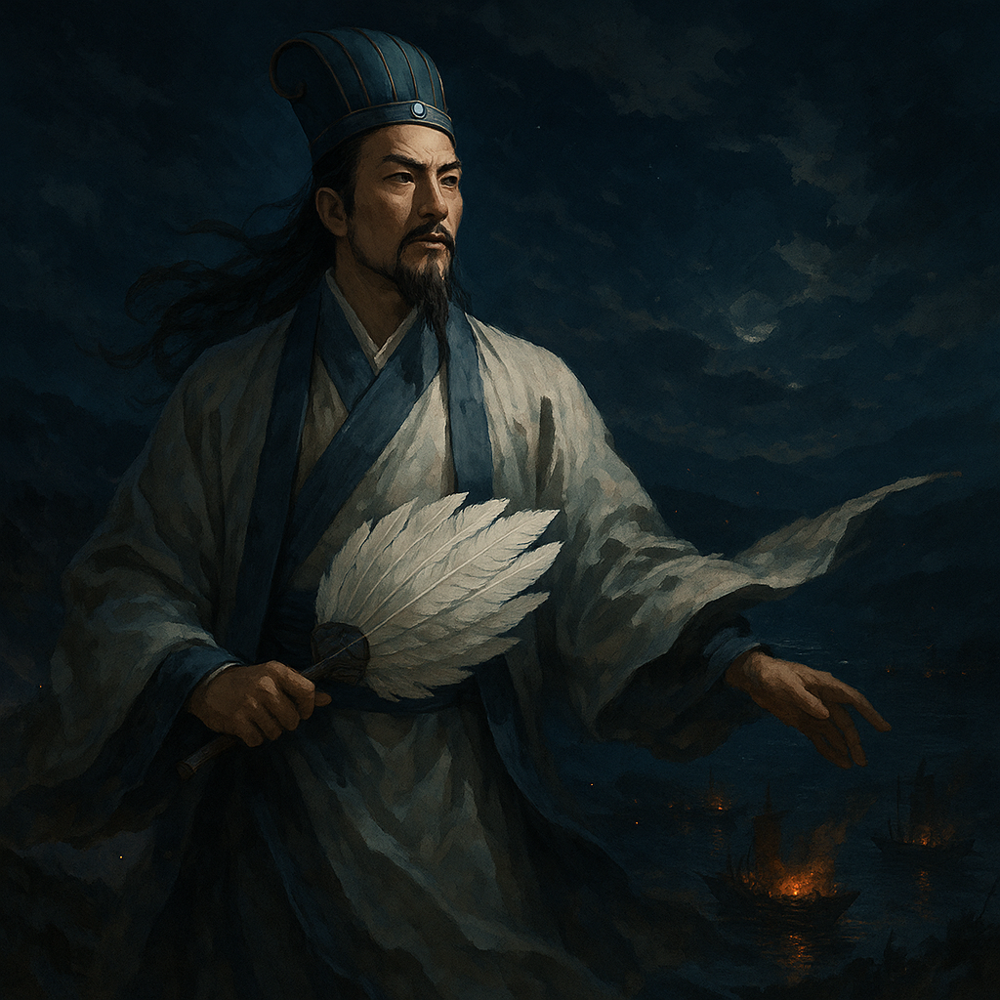

# The Sleeping Dragon Awakens  
*Zhuge Liang and the Battle of Red Cliffs, AD 208*
## 諸葛亮與赤壁之戰  
*A Rekiden Special Scenario – 文藝歷史敘事*

> *A fan, a flame, and the wind that changed an empire.*

This scenario is not a game.  
It is a narrative — one of foresight, silence, and fire.

諸葛亮，字孔明 — the Sleeping Dragon（臥龍）  
His words moved kings. His vision redrew China.

---

*諸葛亮於風中佇立，羽扇輕搖，江面靜靜燃起赤壁之戰的序曲*

*Zhuge Liang contemplates the battle to come. Red Cliffs. Wind. Fire.*

---

## 📖 Table of Contents

1. [Part I: 三顧之禮](#part-i-三顧之禮)  
2. [Part II: 荊州之局](#part-ii-荊州之局)  
3. [Part III: 魯肅之訪](#part-iii-魯肅之訪)  
4. [Part IV: 東吳之辯](#part-iv-東吳之辯)  
5. [Part V: 風火之計](#part-v-風火之計)  
6. [Part VI: 同盟成矣](#part-vi-同盟成矣)  
7. [Part VII: 火燒連環](#part-vii-火燒連環)  
8. [Part VIII: 大軍潰敗](#part-viii-大軍潰敗)  

---

## Part I: 三顧之禮  
*The Ritual of Sincerity*

In the shadowed hills of 臥龍岡, a recluse waited.  
諸葛亮，字孔明 — the Sleeping Dragon（臥龍）.

劉備 came once.  
The recluse was away.

He came again.  
Still, silence.

He came a third time — and waited in snow.

This was 三顧之禮.  
Not a custom. A vow.

> 「天下三分之計」 — The Plan to divide the empire in three.

[Next →](#part-ii-荊州之局)

---

## Part II: 荊州之局  
*The Collapse Before the Storm*

曹操 advanced.  
荊州 crumbled.  
劉表亡。劉備 fled — through 長坂坡.

諸葛亮 spoke:  
「東吳。」

Not sword, but speech.

> 「吾當以言制勝。」 — *I shall win with words.*

[← Previous](#part-i-三顧之禮) ｜ [Next →](#part-iii-魯肅之訪)

---

## Part III: 魯肅之訪  
*The First Conversation*

魯肅 arrived — no army, only tea.

He asked:  
「曹操，真能平天下？」

諸葛亮 pointed to the map.  
魏，有兵。吳，有地。劉備，有人。

> 「非盟不可。」 — *Without alliance, no survival.*

[← Previous](#part-ii-荊州之局) ｜ [Next →](#part-iv-東吳之辯)

---

## Part IV: 東吳之辯  
*Words Before War*

In the court of 吳, 諸葛亮 stood unarmed.  
孫權 listened. 周瑜 watched.

He spoke of 曹操's ambition. Of 吳's position.  
And then:

> 「戰，可保；降，必滅。」  
> *To fight is risk. To surrender is ruin.*

And quietly:

> 「東南之風，可期乎？」 — *Can the southeast wind be trusted?*

[← Previous](#part-iii-魯肅之訪) ｜ [Next →](#part-v-風火之計)

---

## Part V: 風火之計  
*Wind and Fire*

周瑜 prepared 火。  
諸葛亮 waited for 風。

黃蓋 volunteered: 苦肉之計。

> 「七日後，東南起風。」  
> *In seven days, the southeast wind will rise.*

Not faith. 天文 — astronomy.

[← Previous](#part-iv-東吳之辯) ｜ [Next →](#part-vi-同盟成矣)

---

## Part VI: 同盟成矣  
*The Alliance Sealed*

孫權 drew his sword:

> 「有我在，曹操不得越江一步。」  
> *While I live, Cao Cao shall not cross the river.*

同盟成矣。The alliance was forged — in fire, not ink.

> 同盟，不為勝，為存。  
> *Not for conquest, but for survival.*

[← Previous](#part-v-風火之計) ｜ [Next →](#part-vii-火燒連環)

---

## Part VII: 火燒連環  
*The Fire That Broke the River*

黃蓋 feigned surrender.  
曹操 believed.

Then — 火。

Chains burned. Ships vanished.  
東南之風 had come.

> 火燒連環 — *Not battle. Judgment.*

[← Previous](#part-vi-同盟成矣) ｜ [Next →](#part-viii-大軍潰敗)

---

## Part VIII: 大軍潰敗  
*The Collapse of a Giant*

曹操 fled.  
南郡 drowned in smoke.

諸葛亮 stood still.

> 「此非終局，乃是始也。」  
> *This is not the end — it is the beginning.*

天下三分 — not yet peace.  
Only balance, for now.

> Thus ends 赤壁。Thus begins 三國。

[← Previous](#part-vii-火燒連環)

---

## 📎 Tags & Credits

**Tags**:  
`#Rekiden` `#ThreeKingdoms` `#ZhugeLiang` `#諸葛亮` `#赤壁之戰` `#文藝敘事` `#風火連環` `#歷史敘述`

**Created with**:  
**SamizoGPT × ChatGPT-4o**  
*Historical literacy meets linguistic structure.*
