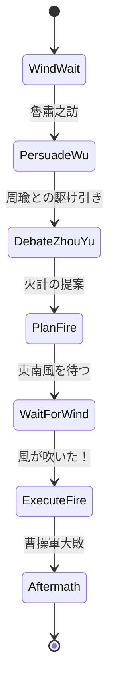

# 📄 red_cliffs_template.md  
*A Structural Template for Game Adaptation – 赤壁之戰 シナリオ構造テンプレート*

---

## 🎭 主人公（Zhuge Liang）状態遷移図（FSM草案）



---

## 🧠 戦略変数定義（Strategic Variables）

| 変数名       | 型       | 説明                                 |
|--------------|----------|--------------------------------------|
| `wind`       | boolean  | 東南の風が吹く（true/false）         |
| `trustWu`    | integer  | 孫権の信頼度（0〜100）                |
| `zhugeliangReputation` | integer  | 君主・武将からの評価（知略）        |
| `fireReady`  | boolean  | 火計が準備されているか                |
| `debateResult` | string  | 周瑜との駆け引き結果（win/loss）     |

---

## 🔁 イベント分岐の例（Event Flow）

### 1. PersuadeWu（東吳の説得）

```
if trustWu >= 70:
    go DebateZhouYu
else:
    fail → retreat or alternative plan
```

---

### 2. DebateZhouYu（周瑜との心理戦）

```
if zhugeliangReputation > 80 and debate roll succeeds:
    debateResult = "win"
else:
    debateResult = "loss"
```

---

### 3. WaitForWind（風待ち）

```
if wind == true and fireReady == true:
    go ExecuteFire
else:
    delay or alternative outcome (曹操が逃れる等)
```

---

## 🎯 エンディング分岐（Victory Conditions）

- ✅ **Strategic Victory**：  
  → 孫権説得成功 + 周瑜との協調 + 火計成功 → 曹操撤退

- ⚠️ **Pyrrhic Victory**：  
  → 周瑜と対立しながらも風を得て勝つが、東吳との信頼が下がる

- ❌ **Failure**：  
  → 説得失敗、風来ず、曹操突破

---

## 📦 利用ガイド

- 本テンプレートはゲーム実装・教材構造化・LLMプロンプト分岐等に利用可能  
- AITL制御構造（FSM × 状態変数 × 出力行動）と親和性が高く、教育シミュレーションにも展開可
