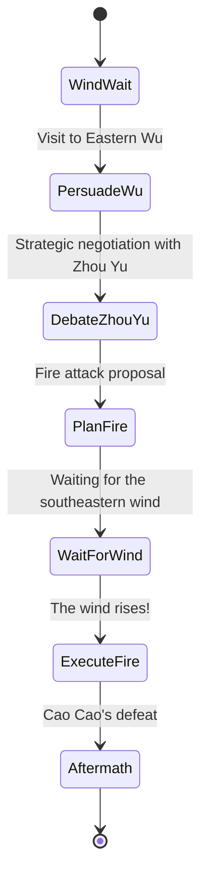

---


# 📄 red_cliffs_template.md  
*A Structural Template for Game Adaptation – The Battle of Red Cliffs*

---

## 🎭 Protagonist (Zhuge Liang) – FSM State Diagram



---

## 🧠 Strategic Variables

| Variable Name      | Type     | Description                                      |
|--------------------|----------|--------------------------------------------------|
| `wind`             | boolean  | Whether the southeastern wind blows             |
| `trustWu`          | integer  | Trust level of Sun Quan (0–100)                 |
| `zhugeliangReputation` | integer  | Reputation of Zhuge Liang (strategic value)     |
| `fireReady`        | boolean  | Whether fire attack preparation is complete     |
| `debateResult`     | string   | Result of negotiation with Zhou Yu (win/loss)   |

---

## 🔁 Event Flow Examples

### 1. PersuadeWu (Convincing Eastern Wu)

```
if trustWu >= 70:
    proceed to DebateZhouYu
else:
    fail → retreat or seek alternative plan
```

---

### 2. DebateZhouYu (Debating with Zhou Yu)

```
if zhugeliangReputation > 80 and debate roll succeeds:
    debateResult = "win"
else:
    debateResult = "loss"
```

---

### 3. WaitForWind

```
if wind == true and fireReady == true:
    proceed to ExecuteFire
else:
    delay or alternative outcome (e.g., Cao Cao escapes)
```

---

## 🎯 Victory Conditions

- ✅ **Strategic Victory**  
  → Successful persuasion + coordination with Zhou Yu + wind + fire attack → Cao Cao's retreat

- ⚠️ **Pyrrhic Victory**  
  → Conflict with Zhou Yu, but still succeeds using wind; trust with Eastern Wu declines

- ❌ **Failure**  
  → Failure to persuade, no wind, or fire plan fails → Cao Cao advances

---

## 📦 Usage Notes

- This template is intended for adaptation into games, educational tools, or LLM-based scenario logic.  
- The FSM × strategic variables × outcome structure is compatible with AITL-style control architectures.
