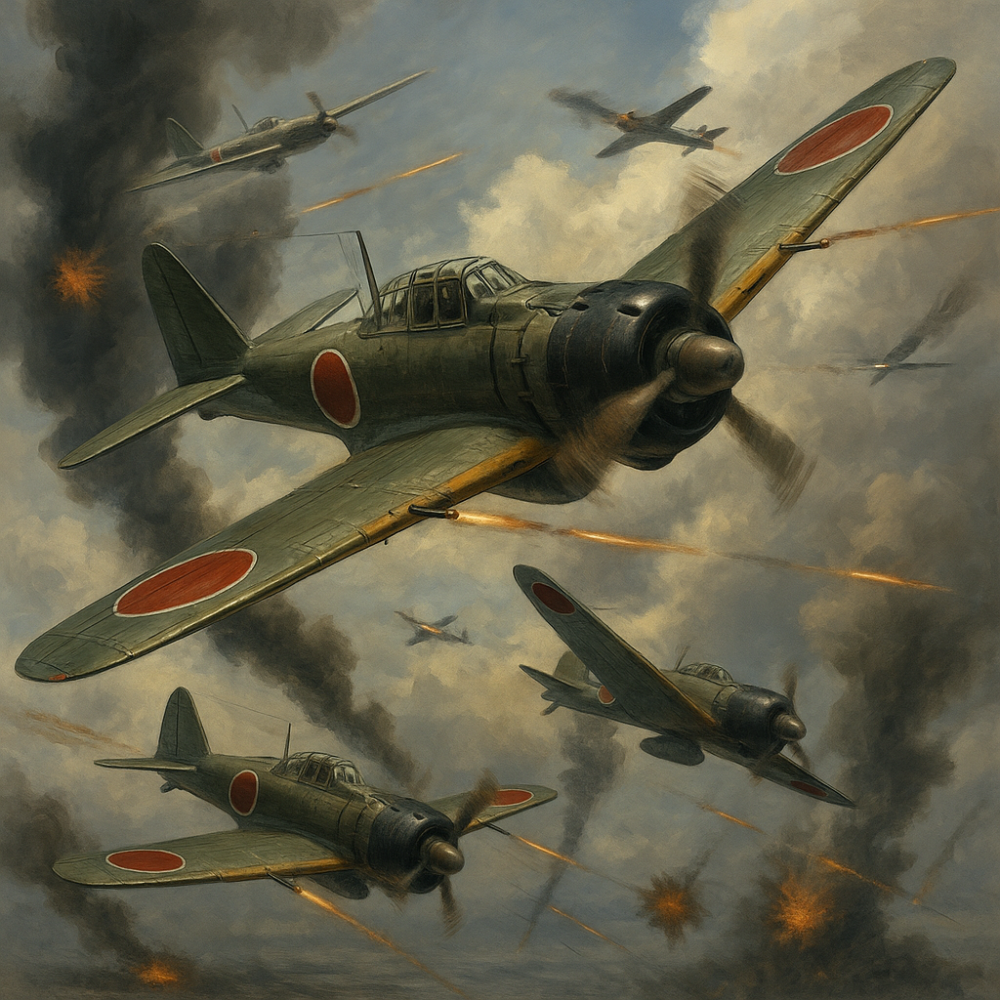

# 🌍 第二次世界大戦：時代背景 / World War II: Historical Context

## 🕊️ 序章 / Prologue

第二次世界大戦（1939–1945年）は、20世紀最大の武力衝突であり、世界中の国家・経済・科学・倫理に深い影響を与えた。1930年代の大恐慌と全体主義の台頭は、ヨーロッパとアジアにおける戦争の火種となり、国家間の対立と軍拡競争を加速させた。

> World War II (1939–1945) was the largest and most devastating conflict of the 20th century. Triggered by economic depression and the rise of totalitarian regimes, the war reshaped global power dynamics and accelerated technological, political, and ethical transformations.

---

## ⚔️ 勃発：1939年 ポーランド侵攻 / Outbreak: Invasion of Poland (1939)

1939年9月、ナチス・ドイツはポーランドに侵攻し、英仏はこれに対抗して宣戦布告。ヨーロッパは全面戦争へと突入した。

> In September 1939, Nazi Germany invaded Poland, prompting Britain and France to declare war. Europe was plunged into total war.

---

## 🌊 太平洋の嵐：日本の南進と真珠湾 / The Pacific Erupts: Japan's Southward Expansion and Pearl Harbor

日本は「大東亜共栄圏」を掲げてアジア太平洋へ進出し、1941年12月、アメリカの真珠湾を奇襲攻撃。米英との戦争が始まり、戦域は地球規模となった。

> Japan, under the banner of the "Greater East Asia Co-Prosperity Sphere", launched a surprise attack on Pearl Harbor in December 1941, bringing the United States and Britain fully into the war. The conflict became truly global.

---

## ⚖️ 転換点：ミッドウェー・スターリングラード・ノルマンディー / Turning Points: Midway, Stalingrad, Normandy

1942年のミッドウェー海戦、1943年のスターリングラード攻防戦、そして1944年のノルマンディー上陸作戦は、枢軸国の攻勢を食い止め、連合国の反攻を決定づけた。

> The Battle of Midway (1942), the siege of Stalingrad (1943), and the D-Day landings in Normandy (1944) marked critical turning points where Axis advances were halted and Allied momentum grew.

---

## ☢️ 科学と倫理：マンハッタン計画と原子爆弾 / Science and Ethics: The Manhattan Project and Atomic Bomb

1945年、アメリカはオッペンハイマーら科学者の手で原子爆弾を開発。広島・長崎への投下は、戦争の終結を早めると同時に、人類に深い倫理的問いを投げかけた。

> In 1945, the U.S. developed the atomic bomb under the Manhattan Project. Its use on Hiroshima and Nagasaki hastened Japan's surrender but also opened a new era of moral and existential questions.

---

## 🕊️ 終結と新秩序：戦後の国際体制 / War's End and New World Order

1945年、ドイツと日本の降伏により戦争は終結。国際連合が設立され、冷戦の構造が始まる中、戦後の復興と価値観の再構築が進められた。

> With the surrender of Germany and Japan in 1945, the war ended. The United Nations was founded, and a new global order—marked by the Cold War—began, accompanied by efforts toward reconstruction and moral redefinition.

---

## 🎮 本シナリオの目的 / Purpose of This Scenario

Rekiden WW2 シナリオでは、歴史的事実を踏まえながらも、**各指導者や科学者の視点**を通じて、戦略・倫理・外交・技術の選択肢を探求する。

> The Rekiden WW2 scenario invites players to explore the choices, dilemmas, and consequences faced by leaders, scientists, and nations during World War II, blending historical insight with interactive narrative reflection.

---

## 📂 収録シナリオ一覧 / Included Scenario Files

| 年代 | 国家 | プレイヤー | タイトル | ファイル |
|------|------|------------|----------|----------|
| 1941年 | 🇯🇵 日本 | 山本五十六 | 真珠湾とミッドウェーの海軍戦略 | [yamamoto_navy.md](./japan/yamamoto_navy.md) |
| 1941年 | 🇺🇸 アメリカ | ルーズベルト | 総力戦と国際同盟の決断 | [roosevelt_strategy.md](./usa/roosevelt_strategy.md) |
| 1945年 | 🇺🇸 アメリカ | オッペンハイマー | 原爆開発と科学倫理の葛藤 | [oppenheimer_ethics.md](./usa/oppenheimer_ethics.md) |
| 1942年 | 🇺🇸 アメリカ | マッカーサー | 太平洋戦線・フィリピン奪還作戦 | [macarthur_pacific.md](./usa/macarthur_pacific.md) |
| 1939年 | 🇩🇪 ドイツ | ヒトラー | ポーランド侵攻と外交の岐路 | [hitler_politics.md](./germany/hitler_politics.md) |

---

> **零戦の空中戦シーン / A6M Zero Fighter Dogfight Scene**  
この迫力ある空中戦は、第二次世界大戦初期における三菱A6M「零戦」の優位性を描いています。優れた旋回性能と長大な航続距離により、零戦は太平洋戦線で連合軍機を圧倒しました。しかし、F6Fヘルキャットなどの新型機の登場によってその優位は短期間で終わります。海上上空の高速戦闘は、日本の初期航空戦略を象徴します。  
This intense aerial battle captures the dominance of the Mitsubishi A6M "Zero" fighter in the early years of World War II. With superior agility and long-range capabilities, the Zero overwhelmed Allied aircraft in the Pacific until newer American fighters like the F6F Hellcat emerged. The scene reflects the high-speed engagements over ocean skies that defined Japan's early air superiority strategy.

---
