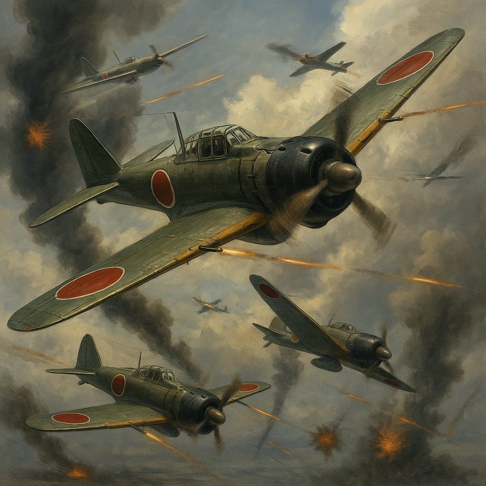

    
---

# 🌍 World War II Scenario: Historical Context

## 🕊️ Prologue

World War II (1939–1945) was the most widespread and devastating armed conflict in human history. Emerging from the aftermath of the Great Depression and fueled by the rise of fascism, militarism, and imperial ambitions, it engulfed every continent and reshaped the political and moral landscape of the 20th century.

---

## ⚔️ Outbreak: Invasion of Poland (1939)

On September 1, 1939, Nazi Germany invaded Poland. In response, Britain and France declared war on Germany. This marked the beginning of a global conflict that would escalate rapidly across Europe, Africa, and Asia.

---

## 🌊 The Pacific Erupts: Japan’s Expansion and the Attack on Pearl Harbor

Japan, pursuing the goal of the "Greater East Asia Co-Prosperity Sphere," expanded aggressively into East Asia and Southeast Asia. On December 7, 1941, Japan launched a surprise attack on the U.S. Pacific Fleet at Pearl Harbor, drawing the United States and the British Empire fully into the war.

---

## ⚖️ Turning Points: Midway, Stalingrad, and Normandy

The tide of war began to turn in favor of the Allies through several key battles:  
- **The Battle of Midway (1942)** crippled Japan’s naval power.  
- **The Battle of Stalingrad (1942–1943)** ended Germany’s eastern ambitions.  
- **The Normandy Landings (D-Day, 1944)** opened the Western Front in Europe.

These moments marked a strategic shift toward Allied momentum and Axis retreat.

---

## ☢️ Science and Ethics: The Manhattan Project and the Atomic Bomb

In 1945, American scientists, led by J. Robert Oppenheimer, completed the Manhattan Project. The atomic bombs dropped on Hiroshima and Nagasaki brought the war in the Pacific to an end, but also initiated a new age of ethical and existential dilemmas surrounding nuclear weapons and the role of science in warfare.

---

## 🕊️ War’s End and a New World Order

With Germany’s surrender in May 1945 and Japan’s in August, World War II came to an end. The United Nations was founded, and the world entered the Cold War era. The postwar years witnessed both physical reconstruction and a profound reevaluation of human values, justice, and governance.

---

## 🎮 Purpose of the Rekiden WW2 Scenario

This scenario set explores World War II through **the perspectives of key historical figures**—military leaders, politicians, and scientists. By engaging with real dilemmas and alternate strategies, players are invited to reflect on the intersection of leadership, morality, and decision-making in times of global crisis.

> You don’t just observe history — you step into it.  
> What choices would you make?

---

## 📂 Scenario List

| Year | Nation  | Player            | Title                                          | File |
|------|---------|-------------------|------------------------------------------------|-------|
| 1941 | 🇯🇵 Japan    | Isoroku Yamamoto | Naval Strategy at Pearl Harbor and Midway      | [yamamoto_navy.md](./japan/yamamoto_navy.md) |
| 1941 | 🇺🇸 USA      | Franklin D. Roosevelt | Total War and the Fate of International Alliances | [roosevelt_strategy.md](./usa/roosevelt_strategy.md) |
| 1945 | 🇺🇸 USA      | J. Robert Oppenheimer | The Ethics of Atomic Science and War           | [oppenheimer_ethics.md](./usa/oppenheimer_ethics.md) |
| 1942 | 🇺🇸 USA      | Douglas MacArthur     | The Pacific Front and Retaking the Philippines | [macarthur_pacific.md](./usa/macarthur_pacific.md) |
| 1939 | 🇩🇪 Germany  | Adolf Hitler          | Invasion of Poland and Diplomatic Brinkmanship | [hitler_politics.md](./germany/hitler_politics.md) |

---

  

> **A6M Zero Fighter Dogfight Scene**  
This intense aerial battle captures the dominance of the Mitsubishi A6M "Zero" fighter in the early years of World War II. With superior agility and long-range capabilities, the Zero overwhelmed Allied aircraft in the Pacific until newer American fighters like the F6F Hellcat emerged. The scene reflects the high-speed engagements over ocean skies that defined Japan's early air superiority strategy.

---

  

> **Fall of Berlin – Soviet Flag over the Reichstag**  
This dramatic scene represents the final days of World War II in Europe, as Soviet forces stormed the heart of Nazi Germany. The iconic image of a Soviet soldier raising the red flag atop the Reichstag became a symbol of victory over fascism. T-34 tanks, rubble-strewn streets, and burning buildings portray the scale of destruction and the cost of urban warfare.

---

  

> **MacArthur Returns – Leyte Gulf Landing, 1944**  
General Douglas MacArthur is seen wading ashore in the Philippines, fulfilling his famous promise: “I shall return.” Wearing his trademark aviator sunglasses and smoking a corncob pipe, this moment marked the beginning of the liberation of the Philippines and symbolized American resolve in the Pacific theater.

---

